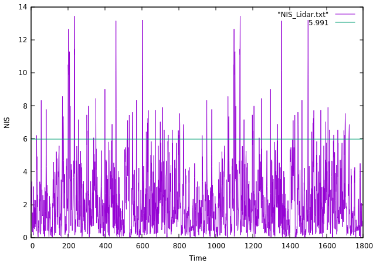

# Unscented_Kalman_Filter_Highway_Project
This is the forth project of Sensor Fusion Nanodegree of Udacity. In this project, I implemented an Unscented Kalman Filter to estimate the state of multiple cars on a highway using lidar and radar measurements. The accuracy is being calculated by the root mean squared error (RMSE) over each time step and for each car. The RMSE is looking at the error difference between the ground truth and estimated position and velocities. Besides, the consistency check of the parameters was done by analyzing Normalized Innovation Squared and X-squared distribution. The following animations show the results of this project. The viewer scene is centered around the ego car and the coordinate system is relative to the ego car as well. The ego car is green while the other traffic cars are blue. The traffic cars will be accelerating and altering their steering to change lanes. Each of the traffic car's has it's own UKF object generated for it, and will update each indidual one during every time step.


The animation above shows the predicted position for the car in the future over a 2 second interval with the green spheres. In this project, the motion model used is CTRV, which assumes constant velocity and turning rate. Since our cars do not have constant turning rates, the predicted paths swing around and take a while to correct after the car begins moving straight again.


The red spheres above cars represent the (x,y) lidar detection and the purple lines show the radar measurements with the velocity magnitude along the detected angle.


The animation above shows the visualization of the cars from the lidar's perspective with point clouds.

## Consistency
I used Normalized Innovation Squared (NIS) and X-squared distribution to check the consistency of the parameters. The following figures show the NIS of Lidar and Radar with each time step respectively. As most of the values is under the 95% line and fews of them over the 95% line, the uncertainty is correctly estimated.




## Usage
Clone the Unscented Kalman Filter Highway Project package.
```
git clone https://github.com/CuteJui/Unscented_Kalman_Filter_Highway_Project.git
```
Go to the Unscented Kalman Filter Highway Project directory
```
cd /home/user/Unscented_Kalman_Filter_Highway_Project
```
Create a new directory
```
mkdir build
```
Go into the build directory
```
cd build
```
Run cmake pointing to the CMakeList.txt in the root
```
cmake ..
```
Run make
```
make
```
Run the executable
```
./ukf_highway
```

## Issue
I provide some potentail solutions to the warning showing up when using cmake.
- `io features related to pcap will be disabled` \
This kind of warning is due to the missing of some extra PCL libraries in the environment. Install the extra PCL libraries could fix this warning.

- `The imported target "vtkRenderingPythonTkWidgets" references the file "/usr/lib/x86_64-linux-gnu/libvtkRenderingPythonTkWidgets.so" but this file does not exist.` \
Install "python-vtk6" and create the link.
```
sudo apt-get update
sudo apt-get install python-vtk6
sudo ln -s /usr/lib/python2.7/dist-packages/vtk/libvtkRenderingPythonTkWidgets.x86_64-linux-gnu.so /usr/lib/x86_64-linux-gnu/libvtkRenderingPythonTkWidgets.so
```

- `The imported target "vtk" references the file "/usr/bin/vtk" but this file does not exist.` \
This can be fixed by the following command.
```
sudo update-alternatives --install /usr/bin/vtk vtk /usr/bin/vtk6 10
```
